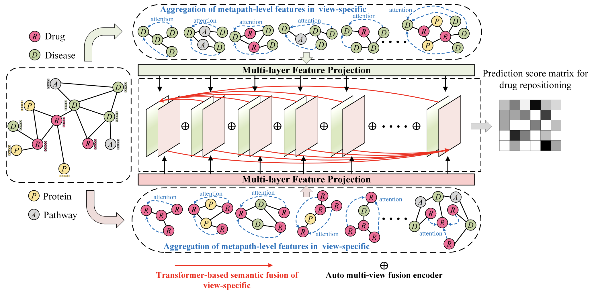








# 😀 Hi there! 

Welcome to Cheng Yang(杨城)’s website!

Previously I obtained my master degree in computer science from Hunan University of Science and Technology where I was advised by [Prof.Li Peng](https://faculty.hnust.edu.cn/pubtphp/jsjkxygcxy/1050047/chinese/).

I’m currently conducting some research in deep learning, including:    
🌲 Large Language Models in Bioinformatics.  
🌱 Interaction Event Prediction in Bioinformatics.  
🌿 Graph Neural Networks for Recommender Systems. 

I have published several papers in Briefings in Bioinformatics (BIB), IEEE/ACM Transactions on Computational Biology and Bioinformatics (TCBB) and IEEE Journal of Biomedical and Health Informatics ([JBHI](https://ieeexplore.ieee.org/author/37089867636)).

**I'm actively seeking a PHD opportunity. If you have any opportunities, please contact me, I would appreciate it. Thanks 😎!**

# 🔥 News
- *2024.07*: &nbsp;🎉🎉 One paper accepted by JBHI'24.
- *2024.07*: &nbsp;🎉🎉 One co-authored paper is under review by [IJBM](https://www.editorialmanager.com/ijbiomac/Default.aspx) journal reviewers.
- *2023.06*: &nbsp;🎉🎉 One paper accepted by JBHI'23.
- *2022.05*: &nbsp;🎉🎉 One paper accepted by BIB'22.
- *2022.09*: &nbsp;🎉🎉 One co-authored paper accepted by TCBB'22!

# 📝 Publications 

JBHI'24

  
[**Drug repositioning via Multi-view Representation Learning with Heterogeneous Graph Neural Network**](https://ieeexplore.ieee.org/abstract/document/9882129) 

Li Peng, **Cheng Yang**, Jiahuai Yang, Yuan Tu, Qingchun Yu, Zejun Li, Min Chen, Wei Liang

- A heterogeneous graph neural network focusing on local structure.
- Transformer's feature fusion mechanism.
- Subgraph feature aggregation.

    <a href="https://ieeexplore.ieee.org/abstract/document/10613361"> <strong>[paper]</strong></a>
    <a href="https://github.com/ychuest/MRLHGNN"> <strong>[code]</strong></a>
    <a href="https://github.com/ychuest/MRLHGNN"> <strong>[Project Page]</strong></a>
    <a class="fakelink" onclick="$(this).siblings('.abstract').slideToggle()" ><strong>[abstract]</strong></a>
    
  
        
 Exploring simple and efficient computational methods for drug repositioning has emerged as a popular and compelling topic in the realm of comprehensive drug development. The crux of this technology lies in identifying potential drug-disease associations, which can effectively mitigate the burdens caused by the exorbitant costs and lengthy periods of conventional drugs development. However, current computational drug repositioning methods face challenges in accurately predicting drug-disease associations. These challenges include only considering drugs and diseases to construct a heterogeneous graph without including other biological nodes associated with the disease or drug for a more comprehensive heterogeneous graph, as well as not fully utilizing the local structure of heterogeneous graphs and rich semantic features. To address these problems, we propose a Multi-view Representation Learning method (MRLHGNN) with Heterogeneous Graph Neural Network for drug repositioning. This method is based on a collection of data from multiple biological entities associated with drugs or diseases. It consists of a view-specific feature aggregation module with meta-paths and auto multi-view fusion encoder. To better utilize local structural and semantic information from specific views in heterogeneous graph, MRLHGNN employs a feature aggregation model with variable-length meta-paths to expand the local receptive field. Additionally, it utilizes a transformerbased semantic aggregation module to aggregate semantic features across different view-specific graphs. Finally, potential drug-disease associations are obtained through a multi-view fusion decoder with an attention mechanism. Cross-validation experiments demonstrate the effectiveness and interpretability of the MRLHGNN in comparison to nine state-of-the-art approaches. Case studies further reveal that MRLHGNN can serve as a powerful tool for drug repositioning. 

    

  

# 🎖 Honors and Awards
- *2020-2023(M.Eng.)*: Outstanding Graduate(2023), National Scholarships for Postgraduate Students(2022), Scholarship(2021).

# 📖 Educations
- *2020.09 - 2023.06*, M.Eng. in Computer Science, School of Computer Science and Technology, Hunan University of Science and Technology
- *2023.09 - 2024.05*, Algorithmic Engineer in Hunan Geely Auto Parts Co.
- *2024.06 - (now)*, Junior Engineer of Large Language Models in the Information Office of the Teaching and Research Support Center, National University of Defense Technology.

 
  Visitor times 
  

