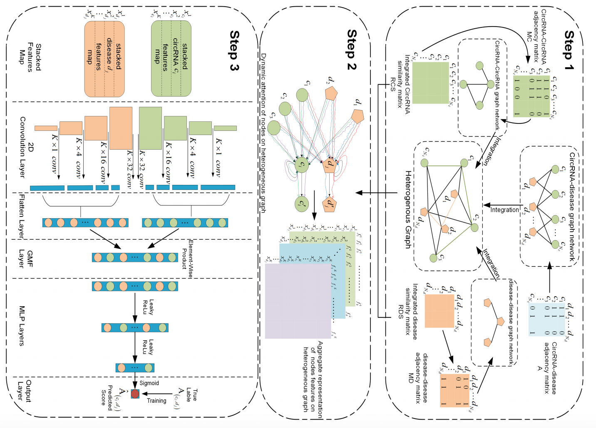
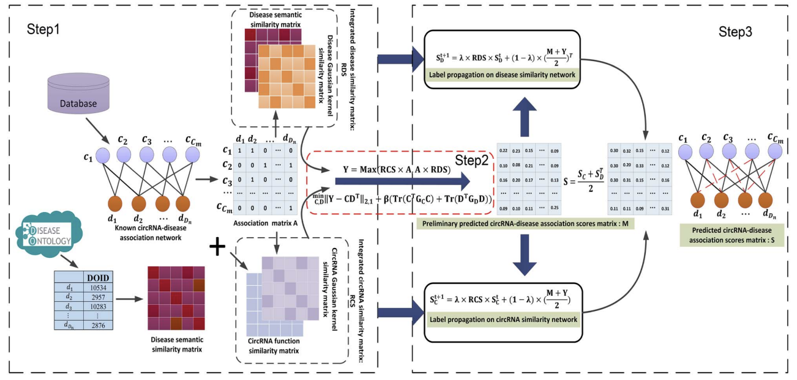








# 😀 Hi there! 

Welcome to Cheng Yang(杨城)’s website!

Previously I obtained my master degree in computer science from Hunan University of Science and Technology where I was advised by [Prof.Li Peng](https://faculty.hnust.edu.cn/pubtphp/jsjkxygcxy/1050047/chinese/).

😎 **Now，I’m currently learning at [College of Computer Science and Electronic Engineering](https://csee.hnu.edu.cn/index.htm), under the supervision of [Prof. Yuansheng Liu](https://csee.hnu.edu.cn/people/liuyuansheng) and [Prof. Xiao Luo](https://grzy.hnu.edu.cn/site/index/luoxiao2)**

I’m currently conducting some research in deep learning, including:    
🌲 **Large Language Models in Bioinformatics**.  
🌱 **Interaction Event Prediction in Bioinformatics**.  
🌿 **Graph Neural Networks for Recommender Systems**. 

I have published several papers in Briefings in Bioinformatics (BIB), IEEE/ACM Transactions on Computational Biology and Bioinformatics (TCBB), and IEEE Journal of Biomedical and Health Informatics ([JBHI](https://ieeexplore.ieee.org/author/37089867636)).

# 🔥 News
- *2024.10*: &nbsp;🎉🎉 One paper accepted by BIBM'24.
- *2024.07*: &nbsp;🎉🎉 One paper accepted by JBHI'24.
- *2024.07*: &nbsp;🎉🎉 One co-authored paper is under review by [IJBM](https://www.editorialmanager.com/ijbiomac/Default.aspx) journal reviewers.
- *2023.06*: &nbsp;🎉🎉 One paper accepted by JBHI'23.
- *2022.05*: &nbsp;🎉🎉 One paper accepted by BIB'22.
- *2022.09*: &nbsp;🎉🎉 One co-authored paper accepted by TCBB'22.

# 📝 Publications 

JBHI'24

  
[**Drug repositioning via Multi-view Representation Learning with Heterogeneous Graph Neural Network**](https://ieeexplore.ieee.org/abstract/document/9882129) 

Li Peng, **Cheng Yang**, Jiahuai Yang, Yuan Tu, Qingchun Yu, Zejun Li, Min Chen, Wei Liang.

- A heterogeneous graph neural network focusing on local structure.
- Transformer's feature fusion mechanism.
- Subgraph feature aggregation.

    <a href="https://ieeexplore.ieee.org/abstract/document/10613361"> <strong>[paper]</strong></a>
    <a href="https://github.com/ychuest/MRLHGNN"> <strong>[code]</strong></a>
    <a href="https://github.com/ychuest/MRLHGNN"> <strong>[Project Page]</strong></a>
    <a class="fakelink" onclick="$(this).siblings('.abstract').slideToggle()" ><strong>[abstract]</strong></a>
    
  
        
 Exploring simple and efficient computational methods for drug repositioning has emerged as a popular and compelling topic in the realm of comprehensive drug development. The crux of this technology lies in identifying potential drug-disease associations, which can effectively mitigate the burdens caused by the exorbitant costs and lengthy periods of conventional drugs development. However, current computational drug repositioning methods face challenges in accurately predicting drug-disease associations. These challenges include only considering drugs and diseases to construct a heterogeneous graph without including other biological nodes associated with the disease or drug for a more comprehensive heterogeneous graph, as well as not fully utilizing the local structure of heterogeneous graphs and rich semantic features. To address these problems, we propose a Multi-view Representation Learning method (MRLHGNN) with Heterogeneous Graph Neural Network for drug repositioning. This method is based on a collection of data from multiple biological entities associated with drugs or diseases. It consists of a view-specific feature aggregation module with meta-paths and auto multi-view fusion encoder. To better utilize local structural and semantic information from specific views in heterogeneous graph, MRLHGNN employs a feature aggregation model with variable-length meta-paths to expand the local receptive field. Additionally, it utilizes a transformerbased semantic aggregation module to aggregate semantic features across different view-specific graphs. Finally, potential drug-disease associations are obtained through a multi-view fusion decoder with an attention mechanism. Cross-validation experiments demonstrate the effectiveness and interpretability of the MRLHGNN in comparison to nine state-of-the-art approaches. Case studies further reveal that MRLHGNN can serve as a powerful tool for drug repositioning. 

    

  

JBHI'23

  
[**Predicting CircRNA-Disease associations via feature convolution learning with heterogeneous graph attention network**](https://ieeexplore.ieee.org/document/10079096) 

Li Peng, Cheng Yang, Yifan Chen and Wei Liu.

- Multi-kernel feature convolutional learning methods.
- Dynamic Attention Mechanism.
- Heterogeneous Graph Feature Representation Learning.

    <a href="https://ieeexplore.ieee.org/document/10079096"> <strong>[paper]</strong></a>
    <a href="https://github.com/ychuest/GATCL2CD"> <strong>[code]</strong></a>
    <a href="https://github.com/ychuest/GATCL2CD"> <strong>[Project Page]</strong></a>
    <a class="fakelink" onclick="$(this).siblings('.abstract').slideToggle()" ><strong>[abstract]</strong></a>
    
  
        
 Exploring the relationship between circular RNA (circRNA) and disease is beneficial for revealing the mechanisms of disease pathogenesis. However, a blind search for all possible associations between circRNAs and diseases through biological experiments is time-consuming. Although some prediction methods have been proposed, they still have limitations. In this study, a novel computational framework, called GATCL2CD, is proposed to forecast unknown circRNA-disease associations (CDAs). First, we calculate Gaussian interactive profile kernel (GIP) similarity and semantic similarity for diseases, circRNA sequence similarity and function similarity, and GIPs for circRNAs. Then, we combine them to construct a heterogeneous graph. Thereafter, GATCL2CD proposes a feature convolution learning framework, that uses a multi-head dynamic attention mechanism to obtain different aggregated representations of features that correspond to the nodes in the heterogeneous graph. Then, it extracts rich higher-order features from the stacked feature representations of each node by using of a single-layer convolutional neural network with filter kernels of different sizes. Finally, a pairwise element-wise product operation is implemented to capture the interactions of higher-order feature representations, and a multilayer perceptron neural network is introduced as an efficient classifier for inferring potential CDAs. Major experimental results under 5-fold cross-validation (5-fold CV) on three different datasets show that GATCL2CD is superior to five other state-of-the-art methods. Furthermore, case studies demonstrate the suitability of GATCL2CD as a useful tool for identifying potential disease-related circRNAs. 

    

  

BIB'22

[**RNMFLP: Predicting circRNA–disease associations based on robust nonnegative matrix factorization and label propagation**](https://academic.oup.com/bib/article/23/5/bbac155/6582881?login=false) 

Li Peng, **Cheng Yang**, Li Huang, Xiang Chen, Xiangzheng Fu and Wei Liu.

- Robust non-negative matrix factorisation.
- Multiple subspace feature propagation.
- Convex Optimisation Optimal Solution Method.

    <a href="https://academic.oup.com/bib/article/23/5/bbac155/6582881?login=false"> <strong>[paper]</strong></a>
    <a href="https://github.com/biohnuster/RNMFLP"> <strong>[code]</strong></a>
    <a href="https://github.com/biohnuster/RNMFLP"> <strong>[Project Page]</strong></a>
    <a class="fakelink" onclick="$(this).siblings('.abstract').slideToggle()" ><strong>[abstract]</strong></a>
    
  
        
 Circular RNAs (circRNAs) are a class of structurally stable endogenous noncoding RNA molecules. Increasing studies indicate that circRNAs play vital roles in human diseases. However, validating disease-related circRNAs in vivo is costly and time-consuming. A reliable and effective computational method to identify circRNA–disease associations deserves further studies. In this study, we propose a computational method called RNMFLP that combines robust nonnegative matrix factorization (RNMF) and label propagation algorithm (LP) to predict circRNA–disease associations. First, to reduce the impact of false negative data, the original circRNA–disease adjacency matrix is updated by matrix multiplication using the integrated circRNA similarity and the disease similarity information. Subsequently, the RNMF algorithm is used to obtain the restricted latent space to capture potential circRNA–disease pairs from the association matrix. Finally, the LP algorithm is utilized to predict more accurate circRNA–disease associations from the integrated circRNA similarity network and integrated disease similarity network, respectively. Fivefold cross-validation of four datasets shows that RNMFLP is superior to the state-of-the-art methods. In addition, case studies on lung cancer, hepatocellular carcinoma and colorectal cancer further demonstrate the reliability of our method to discover disease-related circRNAs. 

    

  

<ul>
  <li>
    <a href="https://www.aimspress.com/article/doi/10.3934/mbe.2024212"> HRGCNLDA: Forecasting of lncRNA-disease association based on hierarchical refinement graph convolutional neural network</a>.Li Peng, Yujie Yang, <strong>Cheng Yang</strong>, Zejun Li, Ngai Cheong. <strong>Mathematical Biosciences and Engineering 2024</strong>. 
    

        <a href="https://www.aimspress.com/article/doi/10.3934/mbe.2024212"> [paper]</a>
        <a class="fakelink" onclick="$(this).siblings('.abstract').slideToggle()" >[abstract]</a>
        
  
            
 Long non-coding RNA (lncRNA) is considered to be a crucial regulator involved in various human biological processes, including the regulation of tumor immune checkpoint proteins. It has great potential as both a cancer biomolecular biomarker and therapeutic target. Nevertheless, conventional biological experimental techniques are both resource-intensive and laborious, making it essential to develop an accurate and efficient computational method to facilitate the discovery of potential links between lncRNAs and diseases. In this study, we proposed HRGCNLDA, a computational approach utilizing hierarchical refinement of graph convolutional neural networks for forecasting lncRNA-disease potential associations. This approach effectively addresses the over-smoothing problem that arises from stacking multiple layers of graph convolutional neural networks. Specifically, HRGCNLDA enhances the layer representation during message propagation and node updates, thereby amplifying the contribution of hidden layers that resemble the ego layer while reducing discrepancies. The results of the experiments showed that HRGCNLDA achieved the highest AUC-ROC (area under the receiver operating characteristic curve, AUC for short) and AUC-PR (area under the precision versus recall curve, AUPR for short) values compared to other methods. Finally, to further demonstrate the reliability and efficacy of our approach, we performed case studies on the case of three prevalent human diseases, namely, breast cancer, lung cancer and gastric cancer. 

        

    

  </li>

  <li>
   <a href="https://ieeexplore.ieee.org/document/9882129"> Predicting Drug-Target Interactions Via Dual-Stream Graph Neural Network</a>. Yuhui Li, Wei Liang, Li Peng, Dafang Zhang, <strong>Cheng Yang</strong>, Kuan-Ching Li. <strong>TCBB 2022</strong>. 
    

        <a href="https://ieeexplore.ieee.org/document/9882129"> [paper]</a>
        <a class="fakelink" onclick="$(this).siblings('.abstract').slideToggle()" >[abstract]</a>
        
  
            
 Drug target interaction prediction is a crucial stage in drug discovery. However, brute-force search over a compound database is financially infeasible. We have witnessed the increasing measured drug-target interactions records in recent years, and the rich drug/protein-related information allows the usage of graph machine learning. Despite the advances in deep learning-enabled drug-target interaction, there are still open challenges: (1) rich and complex relationship between drugs and proteins can be explored; (2) the intermediate node is not calibrated in the heterogeneous graph. To tackle with above issues, this paper proposed a framework named DSG-DTI. Specifically, DSG-DTI has the heterogeneous graph autoencoder and heterogeneous attention network-based Matrix Completion. Our framework ensures that the known types of nodes (e.g., drug, target, side effects, diseases) are precisely embedded into high-dimensional space with our pretraining skills. Also, the attention-based heterogeneous graph-based matrix completion achieves highly competitive results via effective long-range dependencies extraction. We verify our model on two public benchmarks. The result of two publicly available benchmark application programs show that the proposed scheme effectively predicts drug-target interactions and can generalize to newly registered drugs and targets with slight performance degradation, outperforming the best accuracy compared with other baselines. 

        

    

  </li>

  <li>
   <a href="https://link.springer.com/chapter/10.1007/978-3-030-95391-1_39"> Nonnegative Matrix Factorization Framework for Disease-Related CircRNA Prediction</a>. <strong>Cheng Yang</strong>, Li Peng, Wei Liu, Xiangzheng Fu and Ni Li.<strong> Algorithms and Architectures for Parallel Processing(ICA3PP, CCF-C) 2021</strong>.    
    

        <a href="https://link.springer.com/chapter/10.1007/978-3-030-95391-1_39"> [paper]</a>
        <a class="fakelink" onclick="$(this).siblings('.abstract').slideToggle()" >[abstract]</a>
        
  
            
 Nowadays, more and more scholars and related studies have shown that circular RNA (circRNA) is related to the occurrence and development of human diseases. It is necessary to use computational approach to predict potential and unknown associations between circRNA and disease, which will save time and money in developing drugs for treating disease. In this paper, we propose a new computational model called robust nonnegative matrix factorization framework (RNMF), which learns a robust association discriminative representation by using the similarity information structure of network space and L21-norm loss function. Specifically, we use integrated circRNA similarity network and integrated disease similarity network to update known association matrix from the perspective of matrix multiplication at first. Then, the problems of noise and outliers of elements in the updated association matrix are well addressed by the L21-norm loss function. Finally, the computational model is expressed as an optimization problem of objective function solved by iterative algorithm. Experimental results show that our model can achieve better performance than state-of-the-art methods in several aspects. 

        

    

  </li>

</ul>

# 🎖 Honors and Awards
- *2020-2023(M.Eng.)*: Outstanding Graduate(2023), National Scholarships for Postgraduate Students(2022), Scholarship(2021).

# 📖 Educations
- *2020.09 - 2023.06*, M.Eng. in Computer Science, School of Computer Science and Technology, Hunan University of Science and Technology
- *2023.09 - 2024.05*, Algorithmic Engineer in Hunan Geely Auto Parts Co.
- *2024.06 - 2024.12*, Junior Engineer of Large Language Models in the Information Office of the Teaching and Research Support Center, National University of Defense Technology.

# 💬 Invited Talks
- *2021.12*, I previously gave an oral presentation at the 21st International Conference on Algorithms and Architectures for Parallel Processing (ICA3PP'21, CCF-C).

# 💻 Internships
- *2024.06 - 2024.12*, Junior Engineer with Large Language Model joins Network Information Centre of National University of Defence Technology (NUDT), Changsha.

 
  Visitor counts 
  

